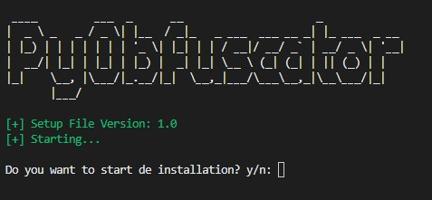
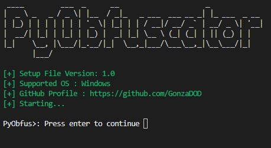
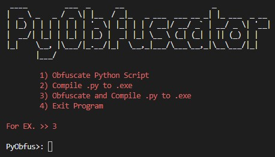

# Simple-Py-Obfuscator
#### > This tool works with PyArmor and PyInstaller to make the obfuscation and compile py to exe. Soo, obviously i give them the half credit. 

# Supported Operating System
### > Just Windows Currently

# Instalation
#### > Open your terminal and use git clone command for cloning this repository `git clone https://github.com/GonzaDOD/Simple-Py-Obfuscator` or download the rar file [here]() and extract the file in your desktop or where you want.
#### > After that you need to open command line in repository folder and execute setup.py using `python3 Setup.py`.

> #### setup.py will install all the dependencies such as PyArmor, PyInstaller, etc.

# Using the tool
###### Now for running the tool you have to open command line in repository folder and use `python3 .\PyObfus` and follow the instructions.

# Finally
##### It's obvious that by using this tool you are agreeing to the [PyArmor End User License Agreement](https://pyarmor.dashingsoft.com/license.html) and [the PyInstaller license](https://pyinstaller.org/en/stable/license.html). I am not responsible for the use you give to the tool, this is for ethical use and I assume that this is the use you are going to give it.
